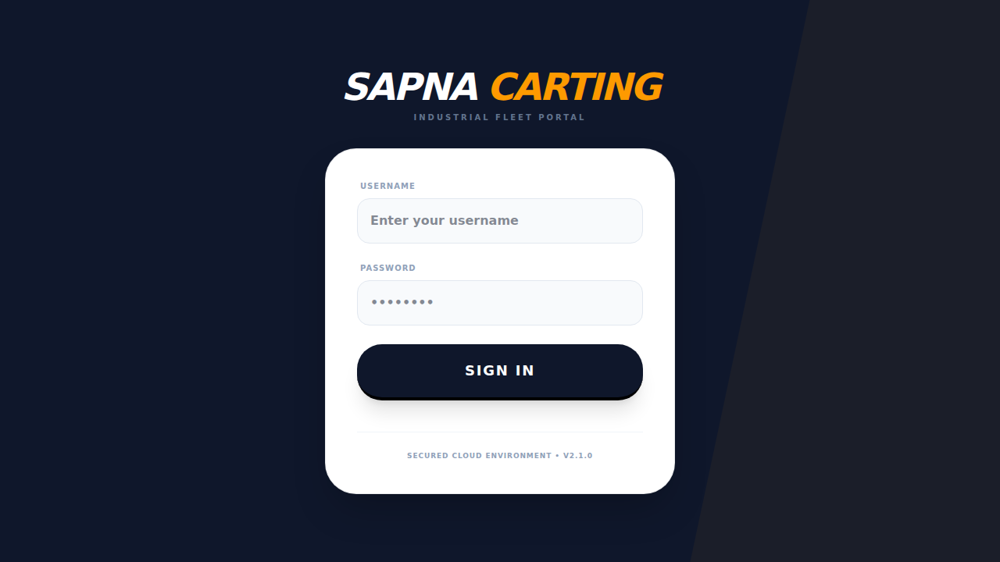

# Sapna Carting - Mining & Trucking Fleet Management System

A comprehensive web-based fleet management application for mining and coal transportation operations. The system tracks vehicle health, tire inventory, fuel efficiency, material transport logs, and provides detailed analytics for fleet optimization.



## Features

### Fleet Management
- **Truck Registry** - Manage vehicle details, documents (RC, fitness, insurance, permits), and expiry tracking
- **Driver Management** - Track drivers, their licenses, duty status, and assignments
- **Tire Inventory** - Full lifecycle management (NEW → MOUNTED → SCRAPPED) with mileage tracking and replacement history

### Operations
| Module | Description |
|--------|-------------|
| **Coal Transport** | Weight-based trip logging with diesel calculations |
| **Mining Operations** | Dispatch/purchase logs with chalan tracking |
| **Fuel Management** | Per-trip and full-tank fueling with photo verification |
| **Bulk Upload** | Excel/CSV import for mining logs |

### Analytics & Reporting
- Dashboard with fleet overview metrics
- Diesel audit with efficiency benchmarks
- Fuel analytics with performance tracking
- Asset reports with PDF/Excel export
- Station ledger for fuel station payments

### AI Integration
- **OCR-based data extraction** from mining chalans/images using Google Gemini AI
- Automated fleet insights generation

## Tech Stack

| Layer | Technologies |
|-------|-------------|
| **Frontend** | React 19 + TypeScript 5.8 + Tailwind CSS 4 |
| **Build Tool** | Vite 6 |
| **Charts** | Recharts 3 |
| **Backend** | Supabase (PostgreSQL) + Auth |
| **Storage** | Cloudflare R2 for images/documents |
| **AI** | Google Gemini API |
| **Exports** | PDF (jsPDF) + Excel (xlsx-js-style) |

## Getting Started

### Prerequisites
- Node.js 18+
- npm or yarn
- Supabase account (for database)
- Cloudflare R2 bucket (optional, for file storage)
- Google Gemini API key (optional, for OCR features)

### Installation

1. Clone the repository:
```bash
git clone <repository-url>
cd minetrack-fleet
```

2. Install dependencies:
```bash
npm install
```

3. Create a `.env` file based on `.env.example`:
```bash
cp .env.example .env
```

4. Update the `.env` file with your credentials:
```env
VITE_SUPABASE_URL=https://your-project-id.supabase.co
VITE_SUPABASE_ANON_KEY=your-anon-key-here
GEMINI_API_KEY=your-gemini-api-key-here
VITE_CLOUDFLARE_WORKER_URL=https://your-worker.your-subdomain.workers.dev
```

5. Set up the database:
   - Run the SQL scripts from `database_schema.sql` in your Supabase SQL editor

6. Start the development server:
```bash
npm run dev
```

7. Build for production:
```bash
npm run build
```

## Role-Based Access Control (RBAC)

The system has 4 user roles:

- **ADMIN** - Full access to all modules (analytics, operations, asset management, system settings)
- **FUEL_AGENT** - Fuel station operations only (fueling entry, history, station ledger)
- **COAL_ENTRY** - Coal transport operations only (trip logging, history)
- **MINING_ENTRY** - Mining operations with bulk upload capability

## Project Structure

```
minetrack-fleet/
├── src/
│   ├── components/        # React components for different views
│   │   ├── Dashboard.tsx
│   │   ├── TruckRegistry.tsx
│   │   ├── TireInventory.tsx
│   │   ├── CoalTransport.tsx
│   │   ├── MiningOperations.tsx
│   │   ├── FuelAgentView.tsx
│   │   ├── FuelAnalytics.tsx
│   │   ├── Reports.tsx
│   │   └── ...
│   ├── services/          # Database, auth, storage, and AI integrations
│   │   ├── dbService.ts
│   │   ├── authService.ts
│   │   ├── storageService.ts
│   │   ├── geminiService.ts
│   │   └── supabaseClient.ts
│   ├── types.ts           # TypeScript type definitions
│   ├── App.tsx            # Main application component
│   └── index.tsx          # Application entry point
├── database_schema.sql    # PostgreSQL database schema
├── R2_SETUP.md           # Cloudflare R2 setup instructions
├── index.html            # HTML entry point
├── vite.config.ts        # Vite configuration
└── package.json          # Project dependencies
```

## Database Schema

The application uses PostgreSQL (via Supabase) with the following main tables:

- **trucks** - Vehicle information and document tracking
- **drivers** - Driver details and duty status
- **tire_inventory** - Tire lifecycle management
- **fuel_logs** - Fueling records with photo verification
- **coal_logs** - Coal transport trip records
- **mining_logs** - Mining dispatch/purchase records
- **daily_odo_registry** - Daily odometer readings
- **fuel_stations** - Fuel station master data
- **fuel_station_payments** - Station payment tracking

See `database_schema.sql` for the complete schema definition.

## Storage Configuration

The application supports two storage modes:

1. **Cloudflare R2** (Recommended) - Via Cloudflare Worker proxy
   - See `R2_SETUP.md` for setup instructions
   - Set `VITE_CLOUDFLARE_WORKER_URL` in your `.env` file

2. **Supabase Storage** (Fallback) - Uses Supabase buckets
   - No additional configuration needed
   - Automatically used if Cloudflare Worker URL is not set

## AI OCR Features

The application uses Google Gemini AI for:
- Extracting data from mining chalans (dispatch/purchase slips)
- Image-to-text conversion for document digitization

To enable AI features:
1. Get a Gemini API key from [Google AI Studio](https://makersuite.google.com/app/apikey)
2. Add it to your `.env` file as `GEMINI_API_KEY`

## Customization

### Fuel Efficiency Benchmarks

Default benchmarks can be customized in Settings:
- Coal liters per trip: [40, 60]
- Mining km per liter: [1.5, 3.0]
- Mining liters per trip: [30, 45]
- Global liters per ton: [0.5, 1.5]

### Master Data

Manage dropdown values in Settings:
- Material types
- Operational sites
- Carting agents
- Loaders
- Customers
- Suppliers
- Royalty names
- Tire suppliers and brands
- Coal sites (loading/unloading)
- Fuel stations

## Browser Support

- Chrome/Edge (latest)
- Firefox (latest)
- Safari (latest)

## License

Private - For Sapna Carting use only.

## Support

For technical support or feature requests, please contact the development team.
